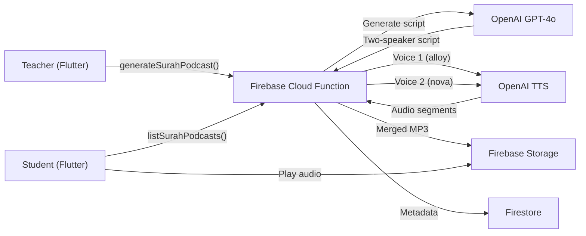

# Surah Podcast Generator

## Architecture




## Backend: Firebase Cloud Function

Create [functions/handlers/surah_podcast.js](functions/handlers/surah_podcast.js) with two callable functions:

### `generateSurahPodcast`

- **Input:** `{ surahName, surahNumber, language (en/ar/fr), classId? }`
- **Auth:** Teacher or admin only
- **Flow:**
  1. Call OpenAI GPT-4o with a structured prompt to generate a two-speaker conversation script about the surah (themes, historical context, lessons, key verses)
  2. Parse the script into alternating speaker segments
  3. Call OpenAI TTS API for each segment (voice `alloy` for the host, voice `nova` for the expert)
  4. Concatenate audio buffers into a single MP3
  5. Upload to Firebase Storage at `surah_podcasts/{podcastId}.mp3`
  6. Save metadata to Firestore `surah_podcasts` collection
- **Output:** `{ podcastId, audioUrl, duration, status }`

### `listSurahPodcasts`

- **Input:** `{ surahNumber?, classId?, limit? }`
- **Auth:** Any authenticated user
- **Returns:** List of podcast metadata with signed download URLs

### `getSurahPodcastPlaybackUrl`

- **Input:** `{ podcastId }`
- **Auth:** Any authenticated user
- **Returns:** Signed URL for audio playback

### Dependencies

- Add `openai` npm package to [functions/package.json](functions/package.json)
- Store OpenAI API key in Firebase environment config (not in code)

### Register in [functions/index.js](functions/index.js)

```javascript
const surahPodcastHandlers = require('./handlers/surah_podcast');
exports.generateSurahPodcast = surahPodcastHandlers.generateSurahPodcast;
exports.listSurahPodcasts = surahPodcastHandlers.listSurahPodcasts;
exports.getSurahPodcastPlaybackUrl = surahPodcastHandlers.getSurahPodcastPlaybackUrl;
```

## Firestore Schema

**Collection:** `surah_podcasts`

- `podcastId` (string) - auto-generated
- `surahName` (string) - e.g. "Al-Baqarah"
- `surahNumber` (int) - 1-114
- `language` (string) - "en", "ar", "fr"
- `classId` (string, optional) - links to a class/shift
- `generatedBy` (string) - teacher UID
- `generatedByName` (string) - teacher display name
- `status` (string) - "generating", "completed", "failed"
- `storagePath` (string) - Firebase Storage path
- `duration` (int) - audio duration in seconds
- `scriptPreview` (string) - first 200 chars of the conversation
- `createdAt` (timestamp)
- `error` (string, optional) - error message if failed

## Flutter Frontend

### Service: `lib/core/services/surah_podcast_service.dart`

- Follows the same pattern as [lib/core/services/class_recording_service.dart](lib/core/services/class_recording_service.dart)
- `generatePodcast(surahName, surahNumber, language)` - calls Cloud Function
- `listPodcasts({surahNumber, limit})` - fetches available podcasts
- `getPlaybackUrl(podcastId)` - gets signed audio URL

### Screen: `lib/features/surah_podcast/screens/surah_podcast_screen.dart`

- **Teacher view:**
  - List of previously generated podcasts (with play/delete options)
  - "Generate Podcast" FAB/button that opens a dialog:
    - Surah picker (dropdown of 114 surahs)
    - Language selector (English, Arabic, French)
    - Optional class association
    - Generate button with loading state
  - Generation progress indicator (poll status until "completed")
- **Student view:**
  - List of available podcasts
  - Inline audio player per podcast (play/pause, seek, duration)
  - Surah filter

### Audio Playback

- Reuse existing `audioplayers` package (already in [pubspec.yaml](pubspec.yaml))
- Build a `PodcastPlayerWidget` following patterns from [lib/features/chat/widgets/voice_message_player.dart](lib/features/chat/widgets/voice_message_player.dart)

### Dashboard Integration

Add the screen to [lib/dashboard.dart](lib/dashboard.dart):

- Add `const SurahPodcastScreen()` at index 27 in the `_screens` list

Add sidebar entries in [lib/features/dashboard/config/sidebar_config.dart](lib/features/dashboard/config/sidebar_config.dart):

- **Teacher sidebar:** Add under "Work" section with `Icons.podcasts` and `screenIndex: 27`
- **Student sidebar:** Add under "Learning" section with `screenIndex: 27`
- **Admin sidebar:** Add under "Communication" section with `screenIndex: 27`

### Localization

Add keys to ARB files ([lib/l10n/app_en.arb](lib/l10n/app_en.arb), [lib/l10n/app_fr.arb](lib/l10n/app_fr.arb), [lib/l10n/app_ar.arb](lib/l10n/app_ar.arb)):

- `surahPodcast`, `generatePodcast`, `selectSurah`, `generating`, `podcastReady`, etc.

Run `flutter gen-l10n` after adding keys.

## OpenAI API Key Setup

Store the key using Firebase Functions config:

```bash
firebase functions:secrets:set OPENAI_API_KEY
```

Access in the Cloud Function via `process.env.OPENAI_API_KEY` with `runWith({ secrets: ["OPENAI_API_KEY"] })`.

## Cost Estimate

Per podcast (approx. 5-minute conversation):

- GPT-4o script generation: ~$0.02-0.05
- OpenAI TTS (two voices, ~3000 words): ~$0.09-0.15
- **Total: ~$0.10-0.20 per podcast**

